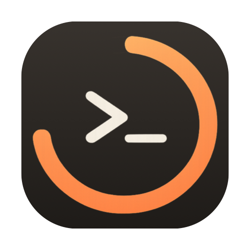
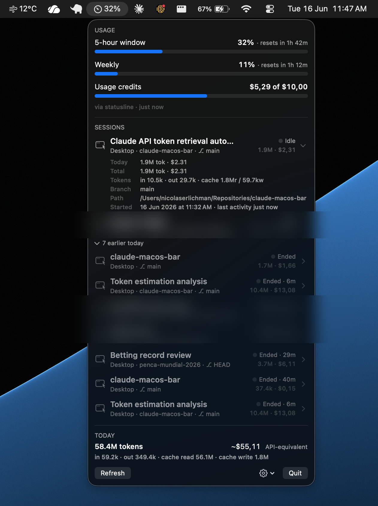

<p align="center">
  
</p>

<h1 align="center">ClaudeBar</h1>

<p align="center">
  A native macOS menu bar app that tracks your Claude Code <strong>usage windows</strong> and <strong>running sessions</strong> across all surfaces — the desktop app, terminal (iTerm), and the VS Code extension.
</p>

<p align="center">
  
  
  
  
</p>

<p align="center">
  
</p>

> [!NOTE]
> ClaudeBar is an unofficial, independent project — not affiliated with or endorsed by Anthropic. It only **reads** the local files Claude Code already writes, plus one optional usage endpoint you authorize.

## What it shows

- **Menu bar**: your 5-hour window utilization (e.g. `42%`), with a ✋ icon when any session is waiting for your input and a ⚠️ icon above 90%. The label style is configurable (Icon + %, % only, Icon only) via the Settings popover; compact styles expand back to the full label whenever something needs attention. **Right-click (or control-click)** the status icon for a quick menu — Open / Refresh / Quit.
- **Dropdown**:
  - Usage windows as titled cards with capsule progress bars and reset countdowns: **Current Session** (5-hour), **All Models** (weekly), a **Sonnet** weekly card (shown only once there's Sonnet usage), and a **Usage Credits** card with your authoritative dollar spend when the account has a credit balance.
  - Every running Claude Code session with its title, project name (worktrees displayed nicely), git branch, surface icon (terminal / desktop / VS Code), and live state — **Active** (generating), **Waiting** (blocked on a permission prompt or your input), or **Idle**.
  - **Click a session to jump to it**: terminal sessions select the exact iTerm tab (matched by the claude process's controlling tty), desktop sessions deep-link to the exact session view (`claude://claude.ai/claude-code-desktop/<id>`, falling back to activating the app), VS Code sessions open the workspace window. The first terminal jump triggers a one-time Automation permission prompt.
  - **Expandable rows**: each session shows its token count and API-equivalent cost inline; expanding reveals today vs lifetime breakdowns.
  - Sessions idle for 60+ minutes collapse into a **dormant** group; sessions that ended collapse into an **earlier today** group.
  - **Today** and **This week** token totals with the API-equivalent cost (informational for subscription plans). Headline token figures count **input + output only** — matching Claude's own usage view — with cache reads/writes broken out separately below. Cost still includes cache, since usage credits bill it at standard API rates.
- **Notifications**: when the 5-hour or weekly window crosses 75% / 90% (once per window), and — opt-in, off by default — when a session starts waiting for your input (the desktop app and terminal already surface that, and Claude re-enters waiting every turn). Delivered as `osascript` banners (Script Editor icon) — native `UNUserNotificationCenter` banners require provisioned signing (Developer ID or an embedded provisioning profile; an Apple Development cert alone is not enough — verified empirically). The app auto-upgrades to native banners if it ever runs with such a signature. A Settings-popover toggle turns notifications off entirely.

## How it works — local-first

Everything except the usage windows comes from local files Claude Code already writes — no credentials, no network. The usage windows optionally call one Anthropic endpoint with a token you authorize (see [Authentication](#authentication--usage-data)).

| Data | Source |
|---|---|
| Running sessions + waiting state | `~/.claude/sessions/{pid}.json` (PID liveness validated via the kernel to filter stale files) |
| Working set vs dormant | Claude Code lifecycle hooks (`SessionStart`/`UserPromptSubmit`/`Stop`/`Notification`/`SessionEnd` → `claudebar-hook.sh` → `events/{session_id}.json`) plus transcript activity; idle sessions untouched for 60+ min collapse into a "dormant" group, and `SessionEnd` hides a session even if its process lingers |
| Session titles | Desktop app session metadata, falling back to the transcript slug |
| Activity (generating vs idle) | mtime of `~/.claude/projects/*/{sessionId}.jsonl` |
| Usage windows (5h / weekly) | Two sources, freshest wins: (a) the OAuth usage endpoint `api.anthropic.com/api/oauth/usage` polled every ~3 min with a token ClaudeBar holds (see [Authentication](#authentication--usage-data)) — exact data; (b) a statusline hook capturing the `rate_limits` JSON Claude Code pushes to statusline scripts (credential-free fallback, only refreshes on terminal interactions — the desktop app does not invoke statuslines) |
| Token/cost stats (per session and per day) | Incremental tail-parsing of the transcript `.jsonl` files |

> [!IMPORTANT]
> The only network call is the usage poll (plus OAuth sign-in/refresh). ClaudeBar never writes to or deletes anything inside `~/.claude` — the statusline/hooks config in `~/.claude/settings.json` is the one exception, added with your consent.

The last good API reading is cached across relaunches, and 429 responses trigger an exponential cooldown (5 min doubling up to 30 min, surfaced in the dropdown).

## Authentication & usage data

The usage windows need an OAuth access token; everything else works without one. Pick whichever path fits — all are optional, and the statusline fallback keeps working regardless.

| Method | Auto-refresh | Needs the terminal? | Keychain item |
|---|:---:|---|---|
| **In-app sign-in** &nbsp;_(recommended)_ | ✅ | No | `ClaudeBar-credentials` |
| **Keychain token** | ✅ | Once, to `claude` login | `Claude Code-credentials` |
| **Manual paste** &nbsp;_(legacy)_ | ❌ | For the copy command | — |

1. **In-app sign-in (recommended — no terminal needed).** Settings → **Sign in to Claude…** runs a standard OAuth Authorization Code + PKCE flow in your browser; you copy the code the callback page shows back into **Paste sign-in code from clipboard**. ClaudeBar stores the result in its **own** Keychain item (`ClaudeBar-credentials`) and refreshes it indefinitely using the stored refresh token (rotated token written back each time). After one sign-in the token never goes stale — you never have to touch the terminal.

2. **Keychain token (for terminal users).** The **Use Keychain token for usage** toggle reads the Claude Code CLI's own Keychain item (`Claude Code-credentials`). That item only exists once you've run `claude` and logged in at least once, but from then on ClaudeBar keeps it fresh on its own — the same auto-refresh as path 1. Good if you live in the terminal and would rather not do a separate in-app sign-in. ClaudeBar's own item (path 1) takes precedence when both exist.

<details>
<summary><b>3. Manual paste (legacy fallback)</b></summary>

Copy the token by hand and click **Paste usage token…**:

```sh
security find-generic-password -s "Claude Code-credentials" -w | jq -r '.claudeAiOauth.accessToken' | pbcopy
```

This one does **not** auto-refresh — when the token rotates the dropdown shows "usage token expired" and you re-paste. Superseded by paths 1 and 2, kept for flexibility.

</details>

> [!NOTE]
> **Why both 1 and 2 exist:** the `Claude Code-credentials` Keychain item is only refreshed while the CLI is *running*, so desktop-only use let its access token expire (the original staleness bug). ClaudeBar now refreshes whichever item it's using via the OAuth refresh token, so neither path goes stale — path 1 just removes the one-time CLI login too.

## Build & run

| Requirement | |
|---|---|
| **Platform** | macOS 14 (Sonoma) or later |
| **Toolchain** | Xcode command line tools · Swift 5.10+ |
| **Dependencies** | None — Apple frameworks only |

| Command | What it does |
|---|---|
| `make run` | Build, bundle, sign, and launch from `build/` |
| `make install` | Build + install to `~/Applications` and launch |
| `make dmg` | Build a shareable `build/ClaudeBar.dmg` |
| `make install-hook` | (Re)install the statusline capture hook |
| `make verify` | End-to-end smoke test |
| `make logs` | Tail `~/Library/Logs/ClaudeBar/claudebar.log` |
| `make stop` | Quit the app |

The Claude Code hooks (statusline capture + lifecycle events) can be installed two ways:

- **From the app**: Settings popover → **Install Claude Code hooks**. The scripts are bundled inside the .app, so this works from a shared .dmg without the repo. It backs up `~/.claude/settings.json` (`settings.json.claudebar-backup`) before registering, never removes existing entries, and preserves a pre-existing statusline command by delegating to it.
- **From the repo**: `make install-hook` copies the scripts; add the registration to `~/.claude/settings.json` yourself:

```json
"statusLine": {
  "type": "command",
  "command": "bash \"$HOME/Library/Application Support/ClaudeBar/statusline-hook.sh\""
}
```

Either way the hook delegates to your original statusline (captured command or `~/.claude/statusline.sh`), so the terminal statusline looks exactly as before. The scripts have no dependencies beyond stock macOS.

## Signing

`scripts/make-app.sh` signs with an Apple Development certificate by default (override with `CODESIGN_IDENTITY=...`, falls back to ad-hoc if the identity isn't in the keychain). A real signature keeps the app's code-signing identity stable across rebuilds, so TCC Automation grants survive. It does **not** enable native notifications — that needs Developer ID signing (see Notifications above).

**Sharing**: `make dmg` produces a drag-to-Applications image that is fully self-contained — recipients install the Claude Code hooks from the Settings popover, no repo needed.

> [!WARNING]
> The app isn't notarized (that requires the paid Apple Developer Program), so recipients must approve it once via **System Settings → Privacy & Security → "Open Anyway"**, and notifications fall back to `osascript` banners on machines without the signing cert. Building from source (`make install`) avoids the Gatekeeper hoop for anyone with Xcode command line tools.

## Notes

- **Launch at login**: toggle in the Settings popover (SMAppService). Flip it from the installed copy (`make install`), so the login item points at `~/Applications/ClaudeBar.app` rather than a build directory.
- Threshold testing: `defaults write dev.gogrow.claudebar debugThresholds -array 1` makes the next evaluation fire at any usage level; `defaults delete dev.gogrow.claudebar debugThresholds` restores 75/90.
- Cost figures use current Claude API per-MTok prices (cache reads at 0.1×, cache writes at 1.25×/2×) — they show what your usage *would* cost at API rates, which is informational if you're on a subscription plan.

## License

[MIT](LICENSE) © 2026 Nicolas Erlichman
