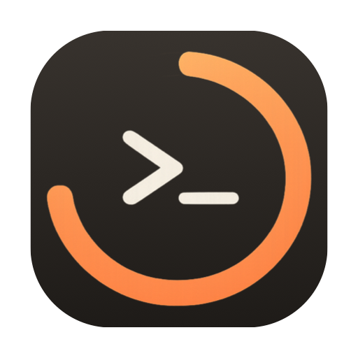
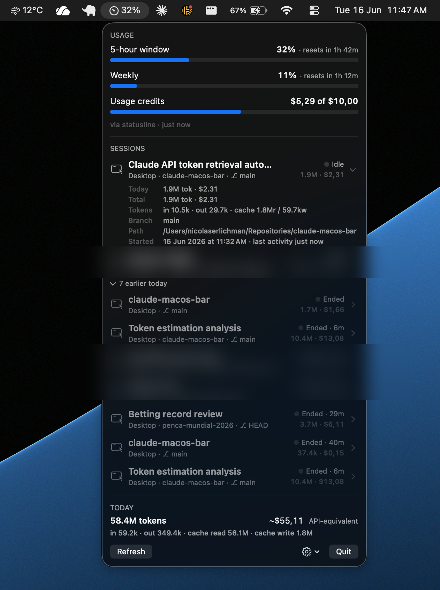

<p align="center">
  
</p>

<h1 align="center">ClaudeBar</h1>

<p align="center">
  A native macOS menu bar app that tracks your Claude Code <strong>usage windows</strong> and <strong>running sessions</strong> across every surface: the desktop app, terminal (iTerm), and the VS Code extension.
</p>

<p align="center">
  
  
  
  
</p>

<p align="center">
  
</p>

> [!NOTE]
> ClaudeBar is an unofficial, independent project, not affiliated with or endorsed by Anthropic. It only **reads** the local files Claude Code already writes, plus one optional usage endpoint you authorize.

## Install

**Homebrew** (recommended):

```sh
brew install --cask nerlichman/tap/claudebar
```

**Or download directly:** grab the latest `ClaudeBar.dmg` from the [Releases page](https://github.com/nerlichman/claudebar/releases/latest), open it, and drag ClaudeBar into Applications.

The release DMG is signed with a Developer ID and notarized by Apple, so ClaudeBar installs with no Gatekeeper warning (Homebrew installs that same notarized build). To compile it yourself instead, see [Build and run](#build-and-run).

## What it shows

Three things: your rate-limit windows, every running session, and threshold notifications.

- **Menu bar**: your 5-hour window utilization (for example `42%`), with a ✋ icon when a session is waiting for your input and a ⚠️ icon above 90%. Three label styles live in the Settings popover (Icon + %, % only, Icon only), and the compact styles expand back to the full label whenever something needs attention. **Right-click (or control-click)** the status icon for Open, Refresh, and Quit.
- **Dropdown**:
  - Usage windows as titled cards with capsule progress bars and reset countdowns: **Current Session** (5-hour), **All Models** (weekly), a **per-model weekly card** for each model with usage this week (Fable, Opus, Sonnet, or whatever else the API reports, since nothing is hardcoded), and a **Usage Credits** card with your authoritative dollar spend when the account has a credit balance.
  - Every running Claude Code session with its title, project name (worktrees displayed nicely), git branch, surface icon (terminal, desktop, or VS Code), and live state: **Active** (generating), **Waiting** (blocked on a permission prompt or your input), or **Idle**.
  - **Click a session to jump to it**: terminal sessions select the exact iTerm tab (matched by the claude process's controlling tty), desktop sessions deep-link to the exact session view (`claude://claude.ai/claude-code-desktop/<id>`, falling back to activating the app), VS Code sessions open the workspace window. The first terminal jump triggers a one-time Automation permission prompt.
  - **Expandable rows**: each session shows its token count and API-equivalent cost inline; expanding reveals today vs lifetime breakdowns.
  - Sessions idle for 60+ minutes collapse into a **dormant** group; sessions that ended collapse into an **earlier today** group.
  - **Today** and **This week** token totals with the API-equivalent cost (informational for subscription plans). Headline token figures count **input + output only**, the same choice Claude's own usage view makes, with cache reads and writes broken out separately below. Cost still includes cache, since usage credits bill it at standard API rates.
- **Notifications**: fired when the 5-hour or weekly window crosses 75% or 90%, once per window. A second notification, opt-in and off by default, tells you when a session starts waiting for your input; it stays opt-in because the desktop app and terminal already surface that, and Claude re-enters waiting every turn. Banners come from `osascript`, which is why they carry the Script Editor icon: native `UNUserNotificationCenter` banners need provisioned signing, meaning a Developer ID signature or an embedded provisioning profile, and an Apple Development certificate alone is not enough (verified empirically). The app upgrades itself to native banners if it ever runs with such a signature, and a Settings-popover toggle turns notifications off entirely.

## How it works: local-first

Everything except the usage windows and model prices comes from local files Claude Code already writes, with no credentials. The usage windows optionally call one Anthropic endpoint with a token you authorize (see [Authentication and usage data](#authentication-and-usage-data)). Model prices come from a public registry (see [How cost is calculated](#how-cost-is-calculated)).

| Data | Source |
|---|---|
| Running sessions and waiting state | `~/.claude/sessions/{pid}.json` (PID liveness validated via the kernel to filter stale files) |
| Working set vs dormant | Claude Code lifecycle hooks (`SessionStart`/`UserPromptSubmit`/`Stop`/`Notification`/`SessionEnd` → `claudebar-hook.sh` → `events/{session_id}.json`) plus transcript activity. Idle sessions untouched for 60+ min collapse into a “dormant” group, and `SessionEnd` hides a session even if its process lingers |
| Session titles | Desktop app session metadata, falling back to the transcript slug |
| Activity (generating vs idle) | mtime of `~/.claude/projects/*/{sessionId}.jsonl` |
| Usage windows (5h and weekly) | Two sources, freshest wins. (a) The OAuth usage endpoint `api.anthropic.com/api/oauth/usage`, polled every 3 min with a token ClaudeBar holds (see [Authentication and usage data](#authentication-and-usage-data)): exact data. (b) A statusline hook capturing the `rate_limits` JSON Claude Code pushes to statusline scripts: a credential-free fallback that only refreshes on terminal interactions, since the desktop app does not invoke statuslines |
| Token and cost stats (per session and per day) | Incremental tail-parsing of the transcript `.jsonl` files. One API response is written as one line per content block, each repeating the whole usage object, so requests are deduped on `message.id` |
| Subagent tokens | `~/.claude/projects/*/{sessionId}/subagents/agent-*.jsonl`. A Task's spend never appears in the parent transcript, so these are parsed separately and added to the session that launched them |
| Which session a request counts toward | Rewinding a chat writes a new transcript that copies the history verbatim, so the same request exists in more than one file. Each is counted once and attributed to the newest snapshot of that conversation, described in [How cost is calculated](#how-cost-is-calculated) |

> [!IMPORTANT]
> The only network calls are the usage poll, OAuth sign-in and refresh, and an anonymous price-registry download every six hours. ClaudeBar never writes to or deletes anything inside `~/.claude`, with one exception: the statusline and hooks configuration in `~/.claude/settings.json`, added with your consent.

The last good API reading is cached across relaunches. Two independent backoffs guard the two endpoints, both surfaced in the dropdown:

- **Usage endpoint 429**: the poll steps back to 1, 5, 10, then 15 min. The token is valid and only throttled, so the connection stays marked active.
- **Token endpoint 429**: refreshes stop for 30 minutes, then 2 hours, 6 hours, and 24 hours, because every attempt during a penalty window restarts it. One success resets the ramp, and a deliberate sign-in never escalates it.

## Authentication and usage data

The usage windows need an OAuth access token; everything else works without one. Pick whichever path fits, since both are optional and the statusline fallback keeps working regardless.

| Method | Renewed by ClaudeBar | Needs the terminal? | Keychain item |
|---|:---:|---|---|
| **In-app sign-in** &nbsp;_(recommended)_ | ✅ | No | `ClaudeBar-credentials` |
| **Keychain token** | ❌ (only while the CLI runs) | Once, to `claude` login | `Claude Code-credentials` |

That second row is the reason the in-app sign-in exists. The CLI's credential is only refreshed while `claude` is *running*, so desktop-only use lets it expire. ClaudeBar will not renew it either, because rotating that token would invalidate it under a running CLI, so on its own it eventually goes stale. Sign in once and ClaudeBar owns a credential it can keep fresh.

1. **In-app sign-in (recommended, no terminal needed).** Settings → **Sign in to Claude…** opens a standard OAuth Authorization Code flow with Proof Key for Code Exchange (PKCE) in your browser. Approve it and the browser hands the code back to the app, with nothing for you to copy. ClaudeBar stores the result in its **own** Keychain item (`ClaudeBar-credentials`) and renews it from the stored refresh token, writing the rotated token back each time.

2. **Keychain token (for terminal users).** The **Use Claude Code (terminal) token** row reads the Claude Code CLI's own Keychain item (`Claude Code-credentials`). That item only exists once you've run `claude` and logged in at least once. ClaudeBar reads it but never refreshes it, so it prefers its own credential whenever both exist and treats the CLI's as a fallback.

**How the sign-in comes back.** ClaudeBar names a loopback address as the OAuth redirect, so a socket on `127.0.0.1` receives the code the moment your browser is redirected. It binds loopback only and is never reachable from the network, the kernel assigns the port, it serves the one request, and it closes on success, on cancel, or after five minutes, whichever comes first. While you are not signing in, the app has no listening socket at all.

This is the approach [RFC 8252](https://datatracker.ietf.org/doc/html/rfc8252) recommends for native apps, and what `gh`, `gcloud`, and `aws sso` do. A code intercepted by another local process is useless without the PKCE verifier, which never leaves the app. If no port can be bound, the flow falls back to the hosted page and a **Paste sign-in code from clipboard** row.

**When a login stops working.** A stored refresh token can stop working, because Claude invalidates them server-side and no amount of retrying brings one back. The settings panel therefore reflects three states:

| State | What you see |
|---|---|
| Working | `Connected — usage updates automatically` · **Sign out of Claude** |
| Expired | `Sign-in expired` · **Reconnect…** |
| Can't renew yet | `Can't renew the saved login right now` · **Reconnect…** |

A rejected refresh token is treated as final: ClaudeBar stops asking the token endpoint and waits for you to reconnect. The quiet failure is deliberate, because retrying a dead token on the poll interval is what earns a 429, and that 429 then blocks renewals for hours.

**Sign out** forgets ClaudeBar's own Keychain item so you can connect a different account. It also turns off the Claude Code token opt-in, since otherwise the next poll would reconnect using the CLI's credential and look like signing out had failed. It never deletes the CLI's item, and it is local only: Anthropic keeps the grant, so signing out stops ClaudeBar using the login rather than revoking it.

## Build and run

| Requirement | |
|---|---|
| **Platform** | macOS 14 (Sonoma) or later |
| **Toolchain** | Xcode command line tools · Swift 5.10+ |
| **Dependencies** | [Sparkle](https://sparkle-project.org) 2 (auto-updates), fetched via SwiftPM; otherwise Apple frameworks only |

| Command | What it does |
|---|---|
| `make run` | Build, bundle, sign, and launch from `build/` |
| `make install` | Build and install to `~/Applications`, then launch |
| `make dmg` | Build a shareable (unsigned) `build/ClaudeBar.dmg` |
| `make dist` | Build a signed, notarized, stapled `build/ClaudeBar.dmg` for release |
| `make appcast` | Regenerate the Sparkle update feed (`appcast.xml`) from `appcast-archives/` |
| `make install-hook` | (Re)install the statusline capture hook |
| `make verify` | End-to-end smoke test |
| `make logs` | Tail `~/Library/Logs/ClaudeBar/claudebar.log` |
| `make stop` | Quit the app |

The Claude Code hooks (statusline capture and lifecycle events) install two ways:

- **From the app**: Settings popover → **Install Claude Code hooks**. The scripts are bundled inside the .app, so this works from a shared .dmg without the repo. It backs up `~/.claude/settings.json` (`settings.json.claudebar-backup`) before registering, never removes existing entries, and preserves a pre-existing statusline command by delegating to it.
- **From the repo**: `make install-hook` copies the scripts; add the registration to `~/.claude/settings.json` yourself:

```json
"statusLine": {
  "type": "command",
  "command": "bash \"$HOME/Library/Application Support/ClaudeBar/statusline-hook.sh\""
}
```

Either way the hook delegates to your original statusline (captured command or `~/.claude/statusline.sh`), so the terminal statusline looks exactly as before. The scripts have no dependencies beyond stock macOS.

## Signing and distribution

`scripts/make-app.sh` signs local builds with an Apple Development certificate by default (override with `CODESIGN_IDENTITY=your_signing_identity_here`, and it falls back to ad-hoc if the identity isn't in the keychain). A real signature keeps the app's code-signing identity stable across rebuilds, so TCC Automation grants survive.

- **`make dmg`**: a drag-to-Applications image (unsigned or dev-signed) for sharing with people who can approve it themselves once via **System Settings → Privacy & Security → “Open Anyway”**.
- **`make dist`**: the public release path, producing a **Developer ID-signed, notarized, and stapled** DMG that installs with no Gatekeeper prompt. It requires a `Developer ID Application` identity and a notarytool keychain profile; see [`scripts/dist.sh`](scripts/dist.sh) for the one-time setup.

Both images are self-contained: recipients install the Claude Code hooks from the Settings popover, with no repo needed. The notarized `make dist` build also delivers native `UNUserNotificationCenter` banners, since it carries a Developer ID signature; other builds fall back to `osascript` banners. Building from source (`make install`) also skips the Gatekeeper step for anyone with the Xcode command line tools.

## Auto-updates (Sparkle)

Notarized release builds update themselves via [Sparkle](https://sparkle-project.org). The app polls an [appcast feed](https://raw.githubusercontent.com/nerlichman/claudebar/main/appcast.xml), prompts you when a newer version is available, and verifies the download against an Edwards-curve Digital Signature Algorithm (EdDSA) signature. Updates are gated to **Developer ID-signed `.app`s only**, so local `make run` and dev builds never self-update and both the “Check for Updates…” menu item and the Settings toggle stay hidden. `scripts/make-app.sh` embeds and signs `Sparkle.framework` into the bundle automatically.

**One-time setup.** Generate the EdDSA signing keys:

```sh
swift build   # so the Sparkle tools exist under .build/artifacts
.build/artifacts/sparkle/Sparkle/bin/generate_keys
```

This stores the **private** key in your login Keychain and prints the **public** key. Paste the public key into `Resources/Info.plist` as `SUPublicEDKey`. Back it up off-machine (`generate_keys -x sparkle_private_key.pem`): losing the private key means no future build can be delivered as an update.

**Per release:** see **[RELEASING.md](RELEASING.md)** for the full flow, covering the version bump, notarized DMG, feed regeneration, and the GitHub release, in the order that keeps the tag and the feed consistent. Two things worth knowing here:

- `CFBundleVersion` **must strictly increase** every release; it's the value Sparkle compares to decide an update exists.
- Each version's DMG lives on its own `vX.Y.Z` GitHub release, and `make appcast` rewrites every enclosure URL to that per-version asset. Past DMGs stay in `appcast-archives/` so the feed can still list older versions, not for delta updates, which aren't used (`--maximum-deltas 0`, pointless for a 2 MB app).

## Settings and troubleshooting

Two settings need explaining, and one log file answers most questions:

- **Launch at login**: toggle in the Settings popover (SMAppService). Flip it from the installed copy (`make install`), so the login item points at `~/Applications/ClaudeBar.app` rather than a build directory.
- **Threshold testing**: `defaults write com.nerlichman.claudebar debugThresholds -array 1` makes the next evaluation fire at any usage level; `defaults delete com.nerlichman.claudebar debugThresholds` restores 75/90.
- **The log**: `~/Library/Logs/ClaudeBar/claudebar.log`, tailed by `make logs`. Sign-in, token refresh, and rate-limit decisions all write a line there, which is the fastest way to see why usage stopped updating.

## How cost is calculated

Cost figures use Claude API per-MTok prices (cache reads at 0.1× on most models, cache writes at 1.25× or 2×, fast mode at 2×). Models priced by prompt length, such as Haiku 5.5 above 100,000 tokens, are costed per request at the tier that request falls in. They show what your usage *would* cost at API rates, which is informational if you're on a subscription plan.

Prices come from [RubyLLM's model registry](https://rubyllm.com/models/), which is rebuilt every six hours from models.dev and Anthropic's API. ClaudeBar downloads it every six hours and saves a copy to `~/Library/Application Support/ClaudeBar/pricing.json`, so new models and price changes arrive without an app update. Models the registry doesn't list yet, bare aliases like `opus`, and retired models use a built-in table (`Sources/ClaudeBar/Usage/CostModel.swift`) matched on the model family, so point releases resolve without an edit. Fast mode and 1-hour cache writes always use the built-in table's rates. A model neither source recognizes falls back to the most expensive tier and the figure is marked approximate.

**Rewound sessions.** Rewinding a conversation (“rewind to here”, or editing an earlier message) doesn't truncate the transcript. Claude Code writes a *new* session file seeded with a copy of the history, keeping each message's original id. A conversation rewound eight times becomes nine files holding nearly identical requests, so counting them per-file bills the same API call up to nine times: measured on one machine, 32% inflation over a week and 2.4× all-time. ClaudeBar counts each request once and reports it under the newest snapshot, the conversation you're still in, so the abandoned ones no longer appear in the list instead of showing slices of a total.

Requests you rewound away were still billed, so they are added to that same row and appear as a separate `Rewound` line when non-zero (7 of 191 sessions on that machine, $5.81 total). That line is the one figure Claude's own per-session view can't show, since the session that billed it no longer exists there. Expect a small difference there and nowhere else.

## License

[MIT](LICENSE) © 2026 Nicolas Erlichman
